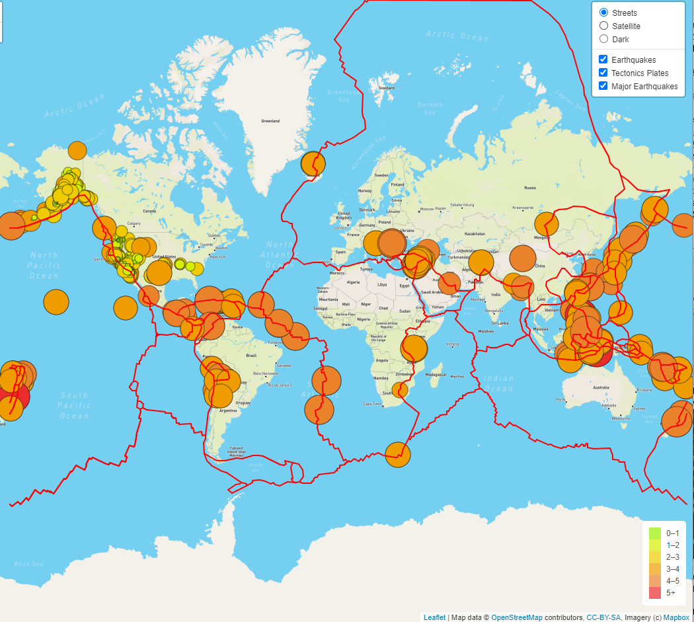

# Mapping_Earthquakes

## Overview

The objective of this project was to create a map that had relevant earthquake data and that showed the details of each earthquake. The project called for multiple layers and toggles for user ease of access.

## Process

I added 3 different styles of map so the user could decide which they prefer. The three maps were street view, satelite view, and dark mode. Three layers were also built so the user could decide what specific data they wanted to see, or if they wanted to see all of it at once. The three layers consisted of all earthquakes, Tectonic plate placement, and a major earthquake layer (greater than 4.5 magnitude). Color matching was created throughout the entire process so it would flow with the data.

## Results

Once everything was added together, we had a 3 different style maps that included all of the same data. The site worked with ease and didn't have any errors both in loading the data and all of the appropriate layers were added. A legend was added to the lower right hand side for better understanding of the color coding. The final site looked like this: 
